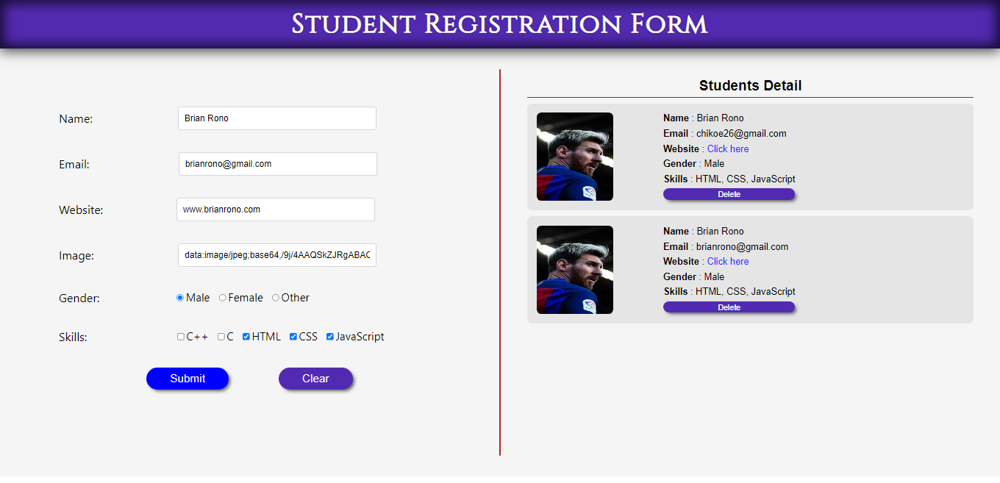

# StudentRegistrationForm
Form that registers first time users to the system

## setting up and running
        METHOD 1
-After downloading the codes in a zip format extract it
and save. Then follow the steps below;
1.)Make sure you have downloaded and installed xampp.
2.)Copy the projects folder into C:\xampp\htdocs.
3.)Run xampp and set up the environment.
4.)Copy the link provided to your browser and run it.

## Tools used

HTML CSS Javascript 

## Image in project

 

## Built By

This project is built and shared by

- Brian Rono

## Feedback

If you have any feedback, please reach out to us at chikoe26@gmail.com

## Tags
HTML CSS Javascript , html code, css code, javascript code
